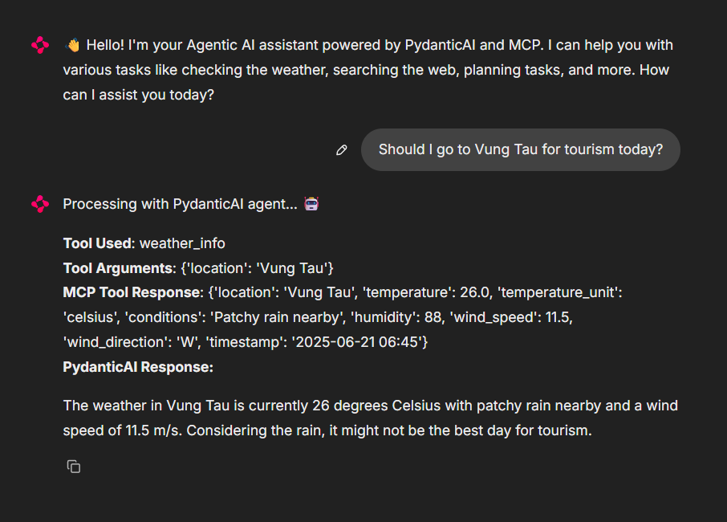

# Agentic AI with Model Context Protocol (MCP)

An interactive AI assistant powered by PydanticAI and the Model Context Protocol (MCP). The agent can perform various tasks using available tools through a simple chat interface.

## Screenshots

<details>
<summary>Click to view CRM - Add Customer</summary>

</details>

<details>
<summary>Click to view CRM - List Customers</summary>

</details>

<details>
<summary>Click to view Agent Tool Usage</summary>

<em>*Agent using tool, it also shows which tools did it use and arguments. Then you can see the response from MCP</em>
</details>

<details>
<summary>Click to view Weather Tool</summary>

</details>

<details>
<summary>Click to view Tool Fetching Process</summary>

</details>

<details>
<summary>Click to view Tool Fetching Extended</summary>

</details>

## Features

- **Time & Date**: Get current time and date information
- **Weather**: Check weather conditions and forecasts (weatherapi.com)
- **Web Search**: Search the web for information (duckduckgo)
- **Memory**: Store and recall information across conversations
- **Planning**: Create task plans and manage goals
- **Calculator**: Perform mathematical calculations
- **CRM**: Manage customer information (MongoDB)

## Setup

1. **Install dependencies**:

   ```bash
   conda env create -f environment.yml
   conda activate mcp-agent
   ```

2. **Create `.env` file** with your API configuration:

    ```env
    API_KEY=your_api_key_here
    MCP_SERVER_URL=http://localhost:8001/sse
    BASE_URL=https://api.mistral.ai/v1
    ```

    ```env
    MONGO_URI=mongodb+srv://<password>@<atlas-url>.mongodb.net/?retryWrites=true&w=majority&appName=Cluster0
    MONGO_DB=June16db
    MONGO_COLLECTION=customers
    WEATHER_API_KEY=<https://www.weatherapi.com/>
    ```

## Usage

1. **Start the MCP server**:

   ```bash
   fastmcp run server/main.py --transport sse --port 8001
   ```

2. **Start the web interface** (in a new terminal):

   ```bash
   chainlit run app.py
   ```

3. **Open your browser** and go to `http://localhost:8000`

## Example Queries

- "What time is it?"
- "What's the weather in Paris?"
- "Remember that I have a meeting at 3 PM"
- "Calculate 15 * 24 + 100"
- "Create a plan for learning Python"
- "Search for information about AI"

## Manual Architecture (no longer using, use Pydantic instead)

```plaintext
┌────────────────┐     ┌─────────────────┐     ┌──────────────┐
│                │     │                 │     │              │
│  Chainlit UI   │◄───►│  Handlers.py    │◄───►│  LLM API     │
│  (app.py)      │     │                 │     │              │
│                │     │                 │     │              │
└────────────────┘     └────────┬────────┘     └──────────────┘
                                │
                                ▼
                       ┌─────────────────┐
                       │                 │
                       │  MCP Client     │
                       │  (mcp_client.py)│
                       │                 │
                       └────────┬────────┘
                                │
                                ▼
                       ┌─────────────────┐
                       │                 │
                       │  MCP Server     │
                       │  (mcp_server.py)│
                       │                 │
                       └─────────────────┘
Pydantic AI is like combination of MCP Client and Handler
```

## License

MIT License
